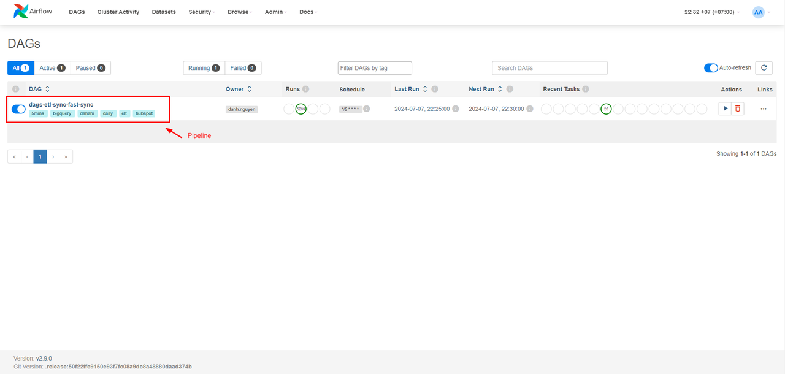
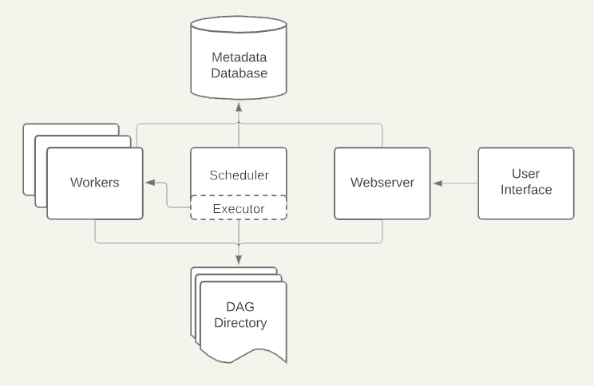

# V25HD Data Engieering Project

Project to run pipeline by following this flow:


- [V25HD Data Engieering Project](#v25hd-data-engineering-project)
  - [Setup](#setup)
    - [Create aliases for long commands with a Makefile](#create-aliases-for-long-commands-with-a-makefile)
    - [Run Airflow Webserver](#run-airflow-webserver)
  - [Infrastructure](#infrastructure)

Folder structure:

```bash
├── Makefile                        # Contains shortcut bash commands
├── README.md                       # Repo document
├── .gitlab-ci.yml                  # Gitlab CI/CD pipeline
├── airflow                         # Airflow root folder
│   ├── Dockerfile                  # Define Airflow image
│   ├── dags                        # Contains Airflow DAG
│   ├── docker-compose.yaml         # Orchestrate Airflow services
│   ├── logs                        # For Airflow save logs
│   ├── plugins                     # Python custom module
│   ├── requirements.in             # Contains Python libraby
│   ├── requirements.txt            # Contains Python libraby
│   ├── secrets                     # Contains credentials secret
│   ├── temp                        # Temp file for future development
│   └── tests                       # Unittest
├── assets                          # Assets for README.md
└── scripts                         # Shell script helper
```

## Prerequisites

* [Docker](https://docs.docker.com/engine/install/)
* [Docker Compose](https://www.digitalocean.com/community/tutorials/how-to-install-and-use-docker-compose-on-ubuntu-20-04)
* [Makefile](https://www.digitalocean.com/community/tutorials/how-to-install-and-use-docker-compose-on-ubuntu-20-04)

You can install Docker & Docker Compose by run scipt [install_docker.sh](./scripts/install_docker.sh)

## Setup

In order to run the project you'll need to install the following:
 
1. [git version >= 2.37.1](https://github.com/git-guides/install-git)
2. [Docker version >= 20.10.17](https://docs.docker.com/engine/install/) and [Docker compose v2 version >= v2.10.2](https://docs.docker.com/compose/#compose-v2-and-the-new-docker-compose-command).

**Windows users**: please setup WSL and a local Ubuntu Virtual machine following **[the instructions here](https://ubuntu.com/tutorials/install-ubuntu-on-wsl2-on-windows-10#1-overview)**. Install the above prerequisites on your ubuntu terminal; if you have trouble installing docker, follow **[the steps here](https://www.digitalocean.com/community/tutorials/how-to-install-and-use-docker-on-ubuntu-22-04#step-1-installing-docker)** (only Step 1 is necessary). Please install the **make** command with `sudo apt install make -y` (if its not already present). 

All the commands shown below are to be run via the terminal (use the Ubuntu terminal for WSL users). The `make` commands in this repo should be run in this repo. We will use docker to set up our containers. Clone and move into the lab repository, as shown below.

```bash
git https://github.com/danhnguyen123/V25HD-Data-Engineering.git
cd V25HD-Data-Engineering
# Start docker containers and create data for exercises and capstone project
make init && make up
```

### Create aliases for long commands with a Makefile

**Makefile** lets you define shortcuts for commands that you might want to run, E.g., in our <u>[Makefile](./Makefile)</u>, we set the alias `up` to spin up Airflow

We have some helpful **make** commands for working with our systems. Shown below are the make commands and their definitions

1. `make init`: Initialize infrastructure
2. `make up`: Spin up Airflow services.
3. `make ui`: Open the Airflow Web-server.
3. `make down`: Shutdown Airflow services.

You can see the commands in <u>[this Makefile](./Makefile)</u>. If your terminal does not support **make** commands, please use the commands in <u>[the Makefile](./Makefile)</u> directly. All the commands in this book assume that you have the docker containers running.

You can start and run the project as:

```bash
make init
make up 
```
### Open Airflow webserver

Use the following command to open Airflow webserver and login with username `airflow` and password `airflow`.

```bash
make ui
```

You also open this Web UI by address http://your-public-ip:8080 (replace your-public-ip by the actual IP address of machine).



## Infrastructure 

We have three major services that run together, they are:

1. **Postgres database**: We use a postgres database to act as metadata database for Airflow services.
2. **Redis databaser**: We create a redis database to act as broker message queue for `airflow-scheduler`.
3. **Airflow services**: There are 3 main services (`airflow-webserver`, `airflow-scheduler` and `airflow-worker`) and some of additional services (`airflow-init`, `airflow-triggered` and `airflow-log-groomer`). You can read this [document](https://airflow.apache.org/docs/apache-airflow/stable/core-concepts/overview.html) to more understand Airflow.


